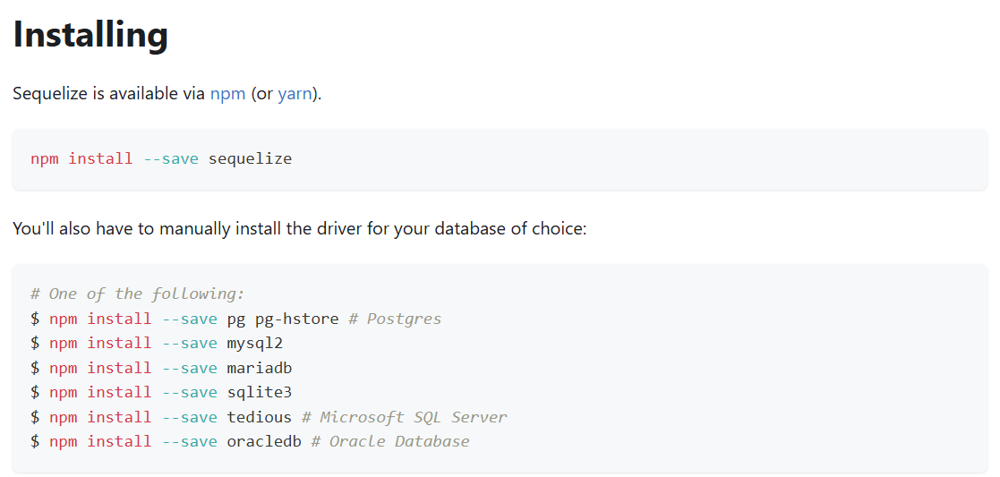

### sequelize

[data-types-sequelize](https://sequelize.org/docs/v7/models/data-types/)

### express

- We can add limits, exclude props, change order in GET requests. Ejm: getProducts

- We can add validation in the handler with express-validator. Ejm: createProduct
